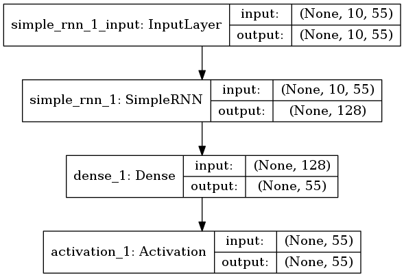

** 注：本节内容来自《Deep Learning with Keras》 **

** 阅读本节之前请先阅读[搭建keras](./搭建keras.md) **
## SimpleRNN with Keras -- Generating text
#### 下载文本数据
[Alice in Wonderland](http://www.gutenberg.org/files/11/11-0.txt)
```
wget http://www.gutenberg.org/files/11/11-0.txt
```
并且放在 /data/alice_in_wonderland

#### 目标
在《爱丽丝梦游仙境》的基础上，训练一个基于字符的语言模型，给10个之前的字符，预测下一个字符，之所以基于字符而不是基于基于单词，是因为字符有更小的词汇表，训练起来更加容易。

```
jupyter notebook
```

#### import necessary modules
```
from keras.layers import Dense,Activation
from keras.layers.recurrent import SimpleRNN
from keras.models import Sequential
from keras.utils import plot_model
import numpy as np
```

#### 做一些清除工作
```
fin=open("../data/alice_in_wonderland.txt","rb")
lines=[]
for line in fin:
    line=line.strip().lower()
    line=line.decode("ascii","ignore")
    if len(line)==0:
        continue
    lines.append(line)
fin.close()
text=" ".join(lines)
```

#### 构建字符/数字映射
```
chars=set([c for c in text])
nb_chars=len(chars)
char2index=dict((c,i) for i,c in enumerate(chars))
index2char=dict((i,c) for i,c in enumerate(chars))
```

#### 构建输入数据
input_chars为字符串数组，每个字符串长10，label_char为字符数组，两者结合起来表示，前面10个字符，来预测后一个字符
```
SEQLEN=10
STEP=1

input_chars=[]
label_chars=[]
for i in range(0,len(text)-SEQLEN,STEP):
    input_chars.append(text[i:i+SEQLEN])
    label_chars.append(text[i+SEQLEN])
```

#### 输入数据向量化
使用one-hot编码
```
X=np.zeros((len(input_chars),SEQLEN,nb_chars),dtype=np.bool)
y=np.zeros((len(input_chars),nb_chars),dtype=np.bool)
for i,input_char in enumerate(input_chars):
    for j,ch in enumerate(input_char):
        X[i,j,char2index[ch]]=1
    y[i,char2index[label_chars[i]]]=1
```

#### 构建模型
```
HIDDEN_SIZE=128
BATCH_SIZE=128
NUM_ITERATIONS=25
NUM_EPOTCHS_PER_ITERATION=1
NUM_PREDS_PER_EPOCH=100

model=Sequential()
model.add(SimpleRNN(HIDDEN_SIZE,return_sequences=False,input_shape=(SEQLEN,nb_chars),unroll=True))
model.add(Dense(nb_chars))
model.add(Activation("softmax"))

model.compile(loss="categorical_crossentropy",optimizer="rmsprop")
```

#### 模型可视化
在这之前，需要先安装pydot和graphviz
```
pip3 install pydot
sudo apt install graphviz
```
然后才能输出
```
plot_model(model,to_file="SimpleRNN.png",show_shapes=True)
```


#### 训练预测
```
for iteration in range(NUM_ITERATIONS):
    print("=" *50)
    print("Iteration #: %d"%(iteration))
    model.fit(X,y,batch_size=BATCH_SIZE,epochs=NUM_EPOCHS_PER_ITERATION)

    test_idx=np.random.randint(len(input_chars))
    test_chars=input_chars[test_idx]
    print("Gerationg from seed: %s"%(test_chars))
    print(test_chars,end="")
    for i in range(NUM_PREDS_PER_EPOCH):
        Xtest=np.zeros((1,SEQLEN,nb_chars))
        for i,ch in enumerate(test_chars):
            Xtest[0,i,char2index[ch]]=1
        pred=model.predict(Xtest,verbose=0)[0]
        ypred=index2char[np.argmax(pred)]
        print(ypred,end="")
        test_chars=test_chars[1:]+ypred
    print('\n')
```
这里的训练方式不同于普通的，外部循环相当于训练的epoch，内部的循环是训练一次之后进行预测的次数，预测不影响下一次的训练。这样设置的目的是，方便观察每次训练的结果。

####　结果
截取最后三次训练的结果如下
```
==================================================
Iteration #: 22
Epoch 1/1
158773/158773 [==============================] - 13s 82us/step - loss: 1.3097
Gerationg from seed:  and down
 and down the caterpillar the baby what i should think the beginning to sinder that the mouse to the other the

==================================================
Iteration #: 23
Epoch 1/1
158773/158773 [==============================] - 11s 68us/step - loss: 1.3083
Gerationg from seed: to win, th
to win, the dormouse she had got to the poor little shriek a right to the white rabbit the caterpillar. alice

==================================================
Iteration #: 24
Epoch 1/1
158773/158773 [==============================] - 11s 70us/step - loss: 1.3066
Gerationg from seed: , we went
, we went on, what a moment the mock turtle read of the work or the work or the work or the work or the work o
```
