注：　使用＃作为标题时，请从 ### 开始使用，请不要使用 # 与 ##

### 预测部分
为了达到接口的可重用性，使用预测模块单独使用一个部分，并且提供简单的借口给其他模块。预测使用python，用到的神经网络使用keras来搭建。

预测分成两个部分，静态预测和动态预测。

- 静态预测：　预先训练好模型，直接使用，而且在预测的时候，不对新产生的数据进行训练。但是可以在一个阶段之后可以使用新产生的数据对模型的参数进行更新。这种方式相对减少了负载。本课题中的与DFS交接的部分使用了这个方式。

- 动态预测：　随着文件使用的反馈，不断进行训练，预测的循环。这种方式将直接使用本地模拟。

#### 其他说明
- 在现有情况下使用深度学习来预测并不是一件特别划算或者说实际的事情，所以本预测只能算得上在相关交叉领域的一个探索。

- 在这种交叉领域内，一方面要提高预测的准确率，一方面又要减小计算量，同时，这种trade-off 又和硬件相关。

#### 论文资料
选择几个启发性比较大的论文作为资料

- 《Learning Memory Access Patterns》 对内存的模式进行预测。使用了两个模型，而且两个都是静态预测：
  - 直接对PC的delta进行预测。先使用最常出现的delta作为考虑对象，其他比较少出现的直接忽略。使用one-hot进行编码，根据delta预取前10个
  - 先对PC的delta进行聚类。由于内存的存取模式有它自己的特性，使用聚类利用了局部性。

这篇论文是很少数将深度学习应用在操作系统领域的一个案例，参考价值很大，它同样是使用了静态预测来减少运算的负载，尽管使用了深度学习本身计算量就很大。

与文件系统的区别在于，d(PC)是有意义的，而d(file_id)却未必有意义。

- 《Design and Implementation of a Predictive File Prefetching Algorithm》 使用相对来说比较简单的算法来预测预取，效果比当前的流行的方式要好。

这篇文章给的启发在于，使用了４种benchmark，而在这之前，关于如何使用benchmark还不是非常清楚。值得注意的是，现在大部分的文件系统的benchmark都是在随机访问的，这种方式其实是对文件系统的不正确模拟，并且对于我们这种使用预测的机制，更加无法使用，因为预测首先就要假设文件的access是有规律的。

- 《File Access Prediction Using Neural Networks》 使用一般全连接的神经网络进行预测。使用的方式比较简单，而且约定文件的数目不大。参考价值不是很大。

#### [静态预测](../LSTM/model_for_generate)
##### [数据](../LSTM/model_for_generate/data)
静态预测使用的数据集是按照该[生成模式](../LSTM/model_for_generate/data/create_data.xls)使用[代码](../LSTM/model_for_generate/model_src/generate_data.ipynb)生成的，最终生成的数据放在[该位置](../LSTM/model_for_generate/data/generate_data)

使用人工生成数据的原因：
- 刚开始并没有找到数据集，详细原因见[说明](../LSTM/README.md)
- 便于与DFS结合的时候测试

##### [模型](../LSTM/model_for_generate/model_src)
在说明模型之前，先做几个假设：
- 文件访问可预测，也就是说，有某种规律性，直观的或者隐藏的
- 提取到的信息足够预测

在探索性质的基础上，很容易就想到，所有能够使用的性质都可能蕴含信息，所以首先利用所有的信息。比如：
- name, 如果只采用字母数字编码，有可能针对name有相应的规律，比如有可能都是前子串相同，"data1","data2"等等。但是直接利用这种编码所需要的训练数据和模型体量很大，而且可能提供的信息量很少。
- id, 文件的id不同于PC值，虽然同样可以作为唯一的标识符，但是这种id并不具有位置的意义。
- extension, 文件的后缀。这个信息量非常少，可以直接使用上一个作为下一个预测。
- directory, 目录，或者节点，这是很重要的一个信息，以下详述。
- size, 相同时期文件访问的大小大致相同，使用上一个作为下一个预测，不需要预测，而且所含信息很少。
- protection, owner, operation, 均同上一个。
- created, modified,access, 关于时间的信息，的确包含信息，但是即便预测出来了也很难使用。

总的来说，最重要的两个可以使用的是id与dir,但是为了探索的完整性，我实际上都使用了。从本质上来说这些内容应当结合起来形成一个统一的预测网络，但是基于以下几点，我分别利用了他们：
- 信息的形式不一致，很难标准化
- 为了便于拓展，有可能增加新的信息来源，但是使用统一模型，就需要完全重新构建。
- 不同信息之间可能能够作为相互的补充，这种补充也许可以通过网络的连接发掘出来。但是实际上这种联系很少，而所付出的代价很大。

本处使用的静态预测，因而可以先训练好，然后再在别处使用load出来即可。训练使用jupyter notebook，　预测模块使用py文件。

###### [id](../LSTM/model_for_generate/model_src/id.ipynb)
人工生成的id趋势如下

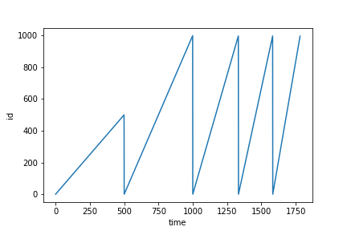

使用的模型构建如下：

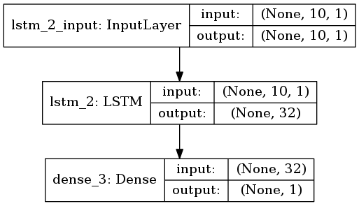

但当前的预测效果并不是很好

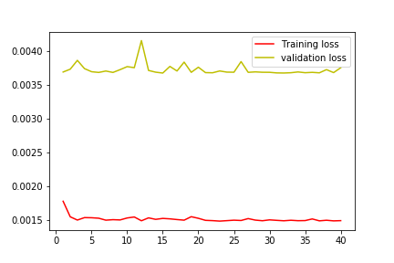

这里解释以下，预测的效果可以从validation loss 来看，training loss 与validation loss 严重分离，代表拟合效果不好。效果不好的根本原因是数据量不够而且不是很贴合实际。

同时，我使用了LSTM, GRU, SimpleRNN，以及相应的bidirectional方式，效果差不多。

###### [directory](../LSTM/model_for_generate/model_src/directory.ipynb)
所用模型构建如下

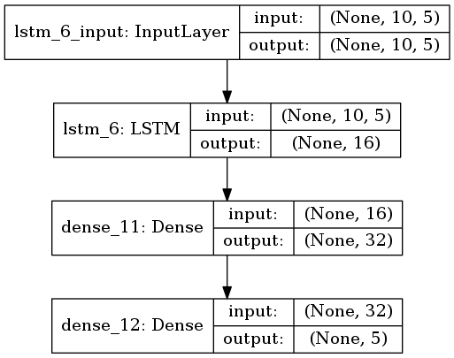

最终的结果如下

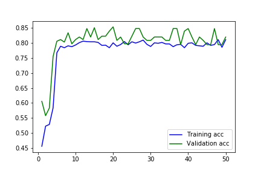

看起来准确率比较高，但也是因为这里构建的数据集比较简单。

##### [模块化](../DFS/predict_1/src/predict.py)
为了模块化，建立一个单独的文件。

#### [动态预测](../LSTM/model_for_strace)
##### 数据
使用了strace跟踪make busybox时候的系统调用
`strace -f -F -t -e trace=file -o ./trace make `
形成的数据大概有217 MB，但是为了简化问题，本次实验只使用busybox 内含的文件，而不使用其他库文件。

###### [数据预处理](../LSTM/model_for_strace/model_src/strace_split.ipynb)
strace 形成的数据，条目非常大，而且有大量的库文件，为了方便和简化问题，仅仅只取在busybox 内的文件作为本次的测试数据

含有一些字符串处理等等。为了更进一步简化问题，这里不涉及目录的处理，并且只考虑在二级目录下的文件。

###### 数据探索
按文件出现的顺序对其进行编码，也包括对目录重新编码，得到dir的趋势如下：

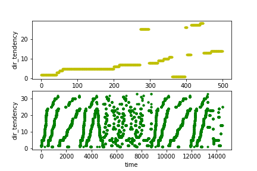

上面的是局部放大，下面的是整体的。

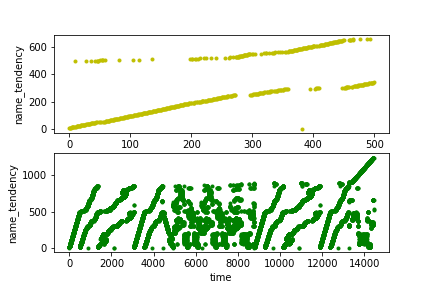

同样，上面的是局部放大，下面的是整体。

从这里可以看出来，当按照出现的顺序进行编码的时候，有明显的可提取特征，或者趋势。

但是直接对文件的名称进行编码，搜索空间太大，无法做到，从而考虑id的差值作为数量，为此，可以先统计一下delta的分布

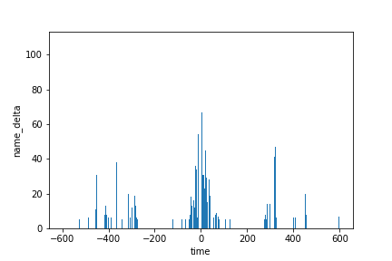

做一下说明，总体的delta序列有14441个，需要编码的delta有966个，但是从图中可以看到，这里的分布比较集中，为了缩小搜索空间，可以只取出现最频繁的。我们取了30个最频繁出现的delta,这30已经囊括了70.5%的delta 序列。

##### [模型](../LSTM/model_for_strace/model_src/model.ipynb)
设计的模型都比较简单

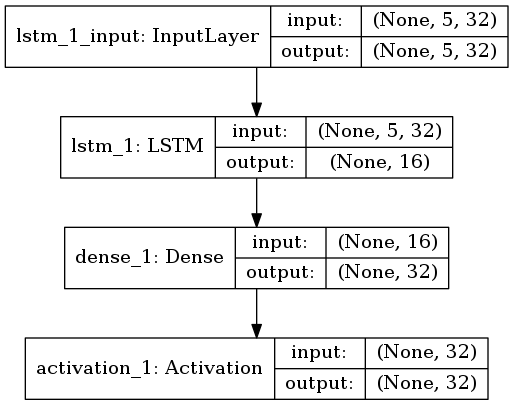

由于这是动态预测，所以是逐步拟合和预测的，结果如图：

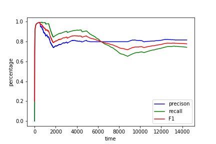

设计一个baseline，用前一个delta作为本次预测，其结果如下：

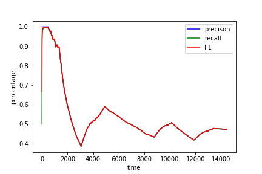

可见使用模型明显好于baseline

##### [模块化](../DFS/predict_1/src/dynamic_predict.py)
为了将动态预测模块化，建立一个py文件，里面的主要函数即dynamic_predict，使用的模型如上文构建。区别在于，在预测开始运行的时候，并不知道出现最频繁的文件，所以需要随着预测的进行不断更新。

使用strace获得的数据测试结果如下：

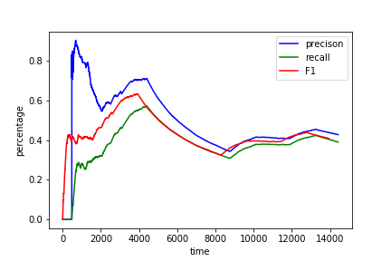

可以看到，效果大概比之前减半，其根本原因就在于，一开始并不知道最频繁文件。这其实就说明，最频繁文件信息会严重影响预测。

另外使用last successor作为baseline,即使用上一次的访问时候的下一个文件作为预测，得到效果如下：

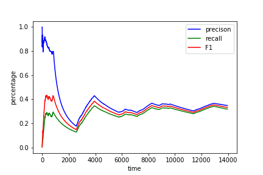

从此处可以看到，在这种动态情况下，神经网络并不比last successor优秀多少。
